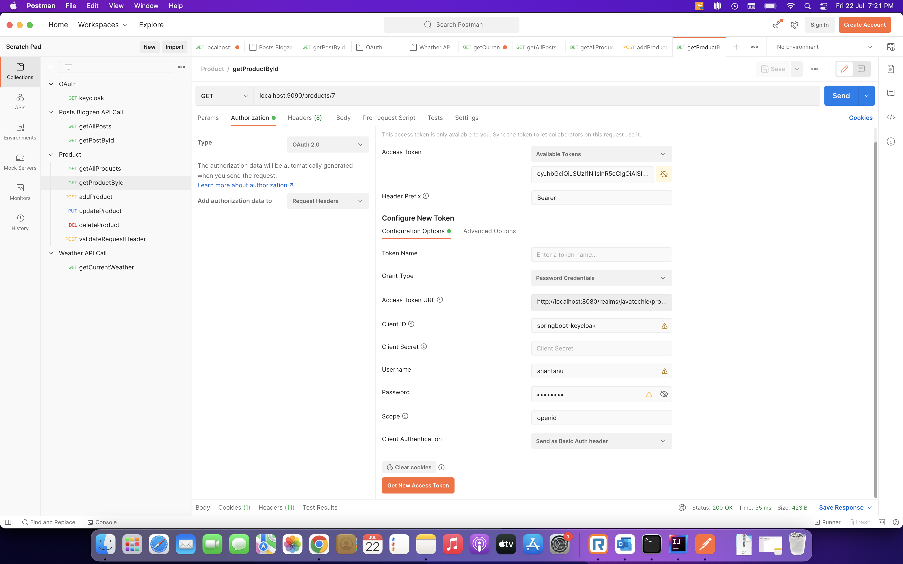
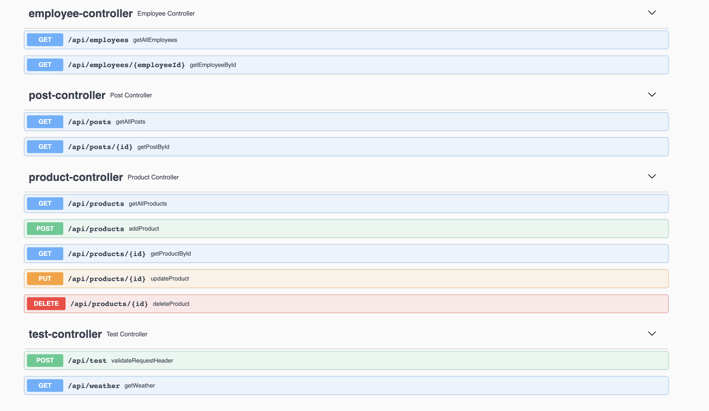

# Spring Boot OAuth Demo with KeyCloak

## Description
**This is a Spring Boot Demo Project which -**
1. Exposes multiple API endpoints.
2. Incorporates OAuth with KeyCloak Authorization Server and Identity and Access Management using OIDC standard.
3. Queries 3rd Party API such as WeatherStack and another Blog Application API hosted on Heroku server.
4. Uses Postman to test API endpoints and pass Access Tokens to the Authorization Server.

## How to Install and Run the Project
1. Clone this repository and open the Project in Intellij IDEA.
2. You'll need to install and run KeyCloak Server on your local machine. Click [here](https://github.com/keycloak/keycloak/releases/download/18.0.2/keycloak-18.0.2.zip) to download.
3. For installation guidelines see [this](https://www.keycloak.org/getting-started/getting-started-zip).
4. After starting the KeyCloak server, go to [http://localhost:8080/](http://localhost:8080/) and create an admin account.
5. Go to the [Keycloak Admin Console](http://localhost:8080/admin) and login with the username and password you created earlier
6. Add a realm referring the KeyCloak documentation [here](https://www.keycloak.org/getting-started/getting-started-zip#_create_a_realm)
7. Create a client ID with Client Protocol as 'openid-connect' and Root URL as http://localhost:9090 . See [this](https://www.keycloak.org/getting-started/getting-started-zip#_secure_your_first_app).
8. Configure 2 roles 'admin' and 'user'. Go to Roles. Add Role Name and Description.
9. Configure 2 or more users and map these roles. Go to Users -> Add User. Enter username and Save. Go to Credentials Tab. Enter Password and set Temporary to OFF.  Click on Set Password. Go to Role Mappings tab. From the available select one of the two roles created earlier. Repeat these steps for another user with different role mapping.
10. We are all set with KeyCloak. In Postman configure OAuth 2.0 as shown below.
    - Grant Type: Password Credentials 
    - Access Token URL: http://localhost:8080/realms/javatechie/protocol/openid-connect/token. Here in the URL, Replace 'javatechie' with your realm name. 
    - Client ID:  < your configured client id >
    - Scope: openid

## API Endpoints Document

